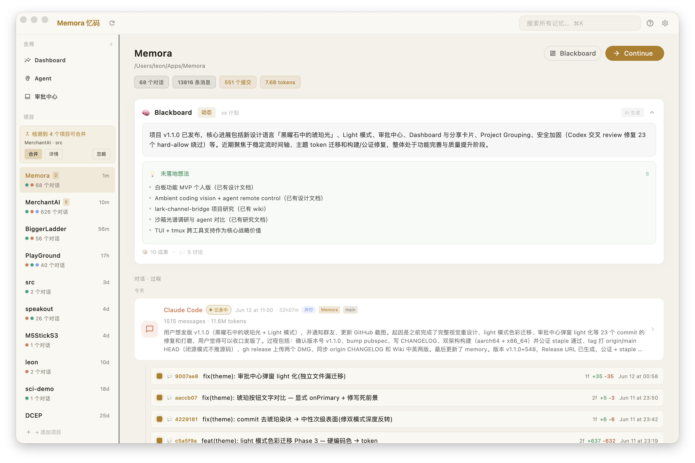
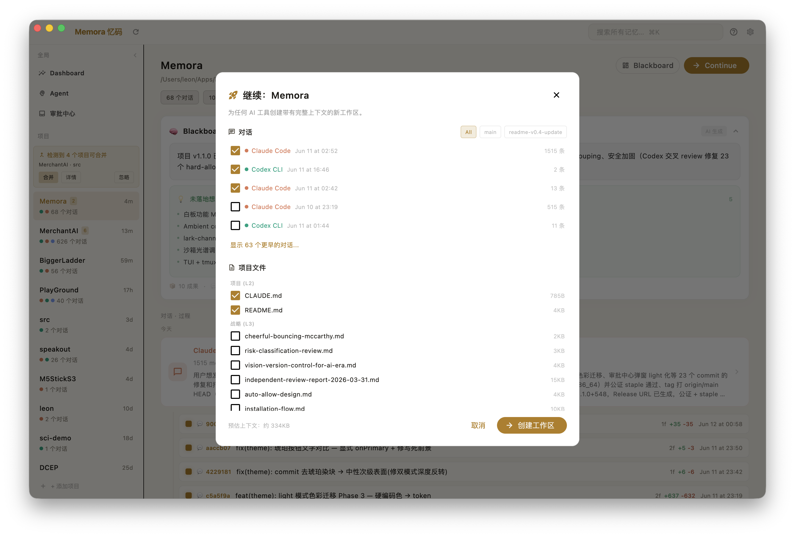
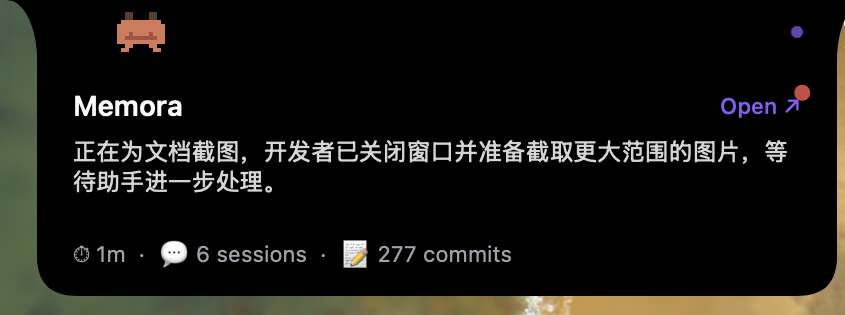
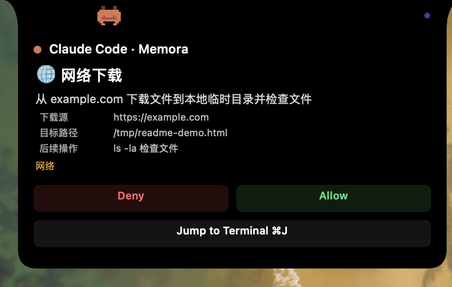
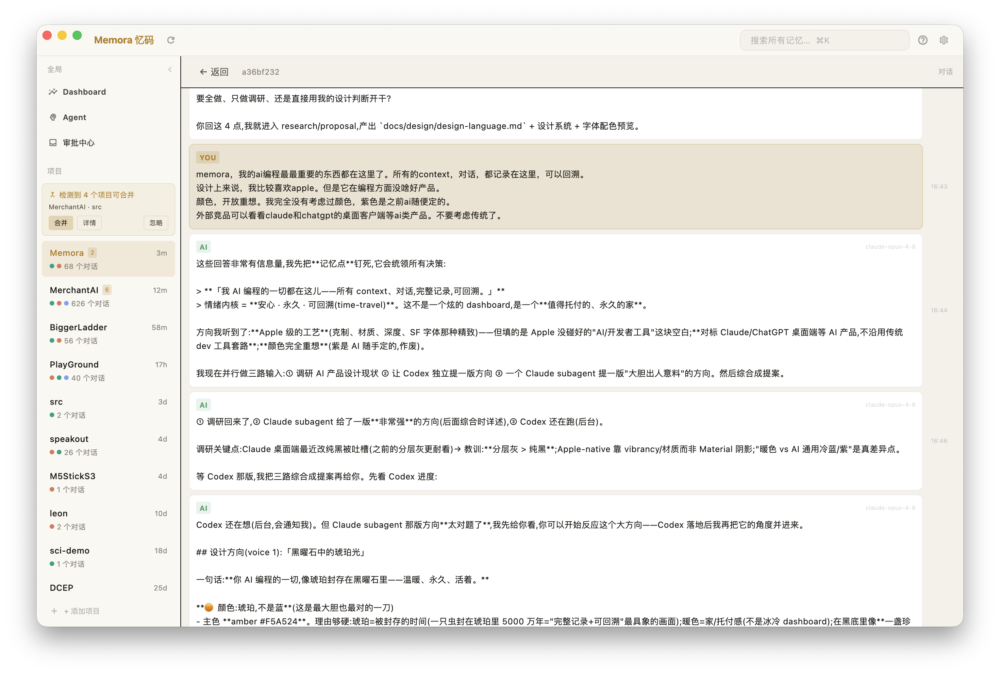
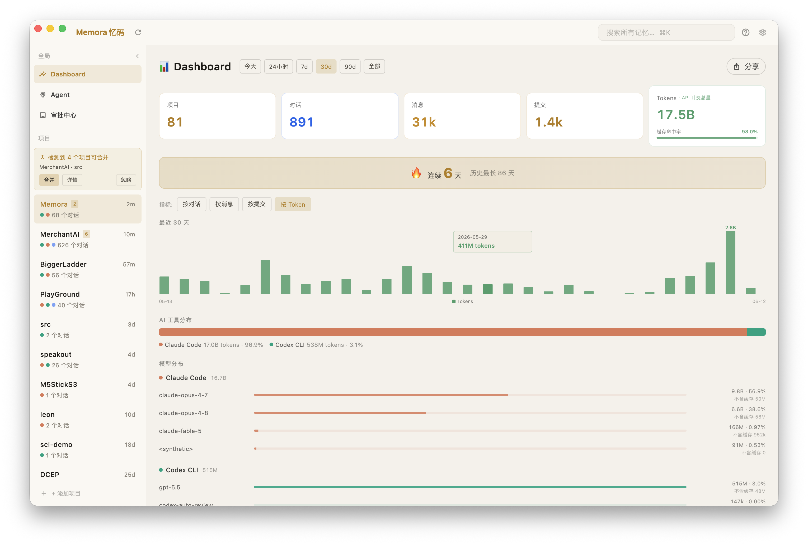

<p align="center">
  
</p>

<h1 align="center">Memora 忆码</h1>

<p align="center">
  <strong>Sé dueño de tu memoria de programación con IA. Continúa en cualquier lugar.</strong><br>
  <sub>Captura, organiza y restaura tus conversaciones de programación con IA en todas tus herramientas.</sub>
</p>

<p align="center">
  <a href="https://github.com/4over7/Memora/releases/latest">Descargar para macOS</a>
</p>

---

<p align="center">
  
</p>

## El Problema

Cada día, los desarrolladores mantienen conversaciones enriquecedoras con asistentes de programación de IA: discuten arquitectura, depuran problemas, toman decisiones de diseño. Pero estas conversaciones son **efímeras**:

- ¿Cierras la terminal? El contexto desaparece.
- ¿Cambias de Claude Code a Cursor? Empiezas de cero.
- ¿Vuelves después de una semana? Olvidaste todo.
- ¿Se activó la compactación? Los detalles se pierden para siempre.

Tus conversaciones con la IA son **registros de toma de decisiones** valiosos, no registros de chat desechables.

## La Solución

Memora se ejecuta silenciosamente en segundo plano, capturando conversaciones de todas tus herramientas de programación con IA y organizándolas por proyecto. Cuando necesites continuar el trabajo —en cualquier herramienta— Memora te devuelve todo tu contexto.

### Herramientas Soportadas

| Herramienta | Método de Captura | Estado |

|---|---|---|
| Claude Code | Hook (tiempo real) | Soportado |
| Codex CLI | Hook (tiempo real) | Soportado |
| OpenCode | Hook + SQLite | Soportado |
| Cursor | Polleo de SQLite | Soportado |

## Características Principales

### Continue V2 — Creación de Espacios de Trabajo Cross-Tool

El diferenciador principal. Selecciona conversaciones, historial de git y archivos de proyecto de cualquier combinación de herramientas y sesiones, y genera un nuevo espacio de trabajo con contexto completo:

- Git clone de tu base de código
- `MEMORA_CONTEXT.md` con el historial completo de conversaciones (bruto, sin comprimir)
- Referencias automáticas a `CLAUDE.md` / `AGENTS.md` para que las herramientas de IA lean el contexto
- Funciona con **cualquier** herramienta de programación con IA

<p align="center">
  
</p>

### Beacon — Dynamic Island para Programación con IA

El Beacon de Memora vive en el notch. Tres estados, siempre precisos:

**Colapsado** — silencioso, ambiental, nunca estorba.

<p align="center">
  
</p>

**Expandido** — estado del proyecto a simple vista: resumen generado por IA + recuento de sesiones + recuento de commits. Se actualiza mientras trabajas.

<p align="center">
  
</p>

**Aprobación Inteligente** — cuando Claude Code quiere ejecutar un comando, Beacon muestra una tarjeta de aprobación para que nunca salgas de tu aplicación actual:

- **Verbo de acción** en una línea + intención (`🌐 Descargar archivo de example.com`)
- Parámetros clave resaltados, shell bruto oculto
- **Veredicto de riesgo de IA** (bajo / medio / alto) como referencia
- Un clic → Permitir / Denegar

<p align="center">
  
</p>

### Modo No Asistido (Unattended Mode)

Cuando confíes en que la IA maneje operaciones rutinarias, activa el Modo No Asistido: la IA aprueba automáticamente todo **excepto** las coincidencias en la lista de denegación y los veredictos de alto riesgo. Solo aquello que realmente importa se detendrá para preguntarte. Actívalo en Ajustes.

### Línea de Tiempo de Doble Vía

Las conversaciones y los commits de git coexisten en una línea de tiempo de flujo estable: los commits **se anidan bajo la conversación que los produjo** (Context-Linked), para que veas qué se discutió y qué se construyó, juntos. Abre cualquier sesión para leer la conversación completa, preservada palabra por palabra.

<p align="center">
  
</p>

### Blackboard

Análisis de proyecto impulsado por IA: resultados recientes, discusiones activas e ideas no implementadas, generados a partir de tu historial de conversaciones y git.

### Dashboard — Analíticas Cross-Proyecto

Una vista panorámica de todos tus proyectos: sesiones, mensajes, commits y uso de tokens a lo largo del tiempo, con desgloses por herramienta y por modelo. El conteo de tokens usa la base de facturación (prorrateado por modelo), anotando la salida real frente a las relecturas de caché, para que veas exactamente a dónde va tu gasto.

<p align="center">
  
</p>

### Modelo de Conocimiento de Seis Capas

Organiza el conocimiento del proyecto en capas:

| Capa | Nombre | Ejemplo |
|---|---|---|
| L1 | Persona | Preferencias del usuario, estilo de codificación |
| L2 | Contexto | CLAUDE.md, reglas del proyecto |
| L3 | Estrategia | Documentos de diseño, planes |
| L4 | Ejecución | Tareas, TODOs |
| L5 | Diálogo | Conversaciones (el proceso) |
| L6 | Resultado | Git commits (los resultados) |

### Ramificación de Historial (History Branching)

Regresa a cualquier punto en el historial de tu proyecto y crea una nueva rama, con el contexto completo de la conversación de ese momento, más una "visión retrospectiva" opcional sobre lo que sucedió después.

## Instalación

### Requisitos

- macOS (Apple Silicon)
- Una o más herramientas de programación con IA soportadas

### Descarga

Descarga el DMG más reciente desde [Releases](https://github.com/4over7/Memora/releases).

1. Abre el DMG
2. Arrastra **Memora** a **Applications** (Aplicaciones)
3. Inicia Memora; te pedirá instalar los hooks en tus herramientas de IA
4. Comienza a programar con cualquier herramienta soportada; Memora capturará automáticamente

### Primer Inicio

En el primer inicio, Memora:
1. Pedirá permiso para instalar hooks en las herramientas de IA detectadas
2. Importará el historial de conversaciones existente
3. Mostrará una guía interactiva de la interfaz

## Arquitectura

```
Hook CLI → ~/.memora/events.jsonl + ~/.memora/raw/
                    ↓
              SQLite (índice)
                    ↓
            Flutter Desktop UI
```

- **Frontend**: Flutter (macOS desktop)
- **Backend**: Rust (3 crates: memora-core, memora-ingest, memora-hook)
- **Puente**: flutter_rust_bridge v2.12
- **Datos**: Todos los datos permanecen locales. Nada se sube a ningún lugar.

## Privacidad

Memora es **100% local**. Tus conversaciones, código y datos nunca salen de tu máquina. No hay sincronización en la nube, ni telemetría, ni analíticas.

## Idioma

Memora soporta inglés y chino (中文). Cambia el idioma en Ajustes.

## Autor

**Leon Xu (云梦泽)** — EastWorld ltd.

## Licencia

Memora es software propietario. Todos los derechos reservados.
