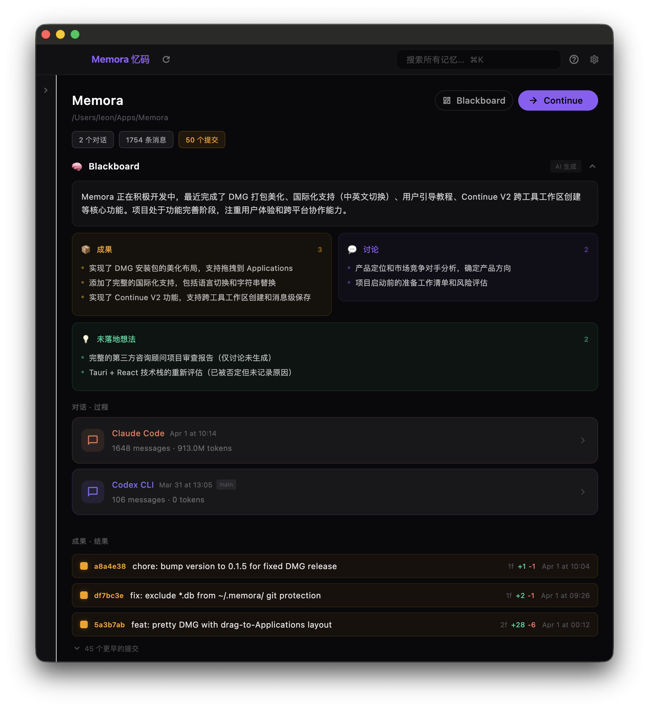
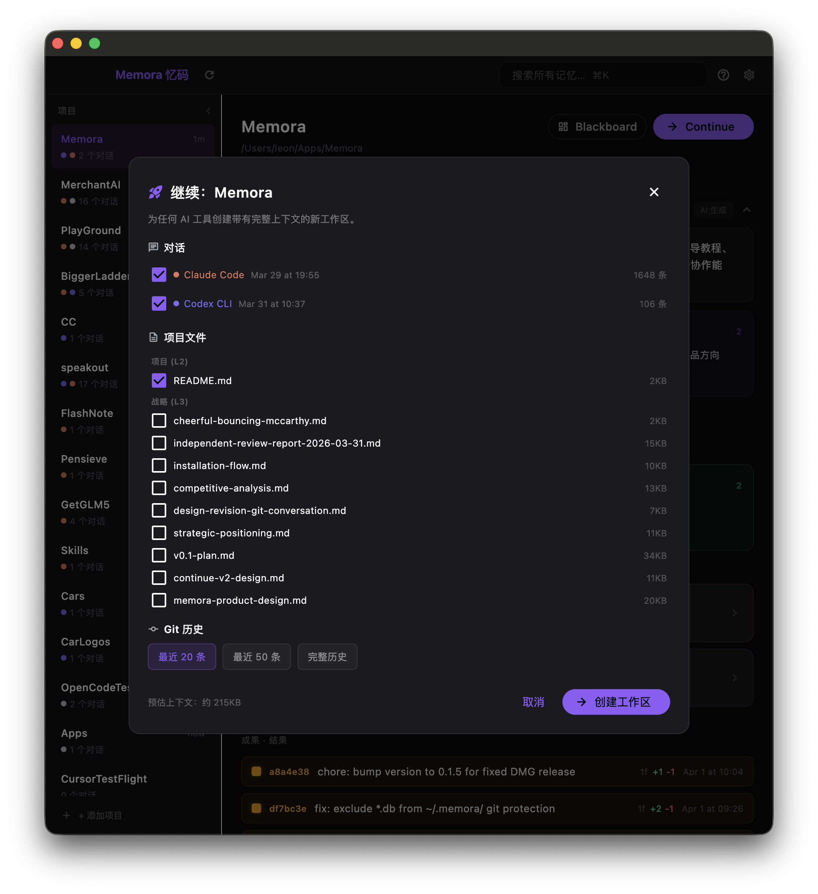
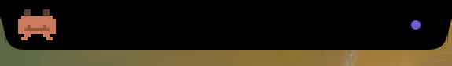
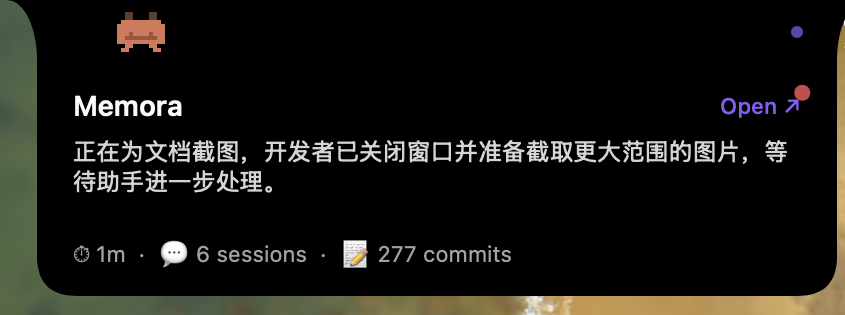
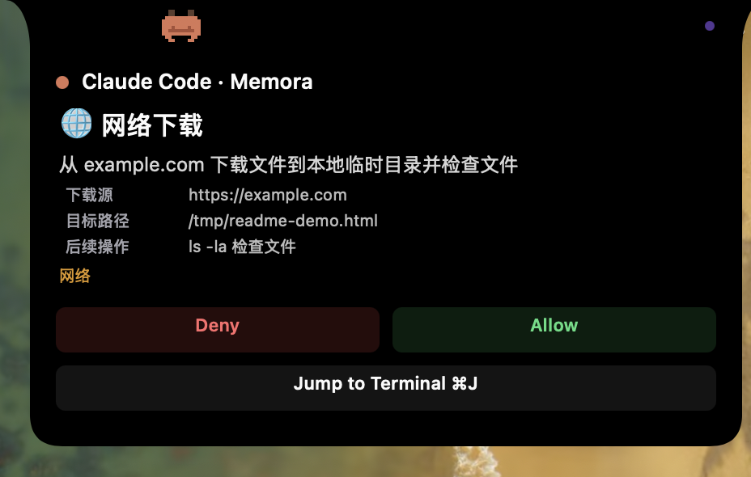
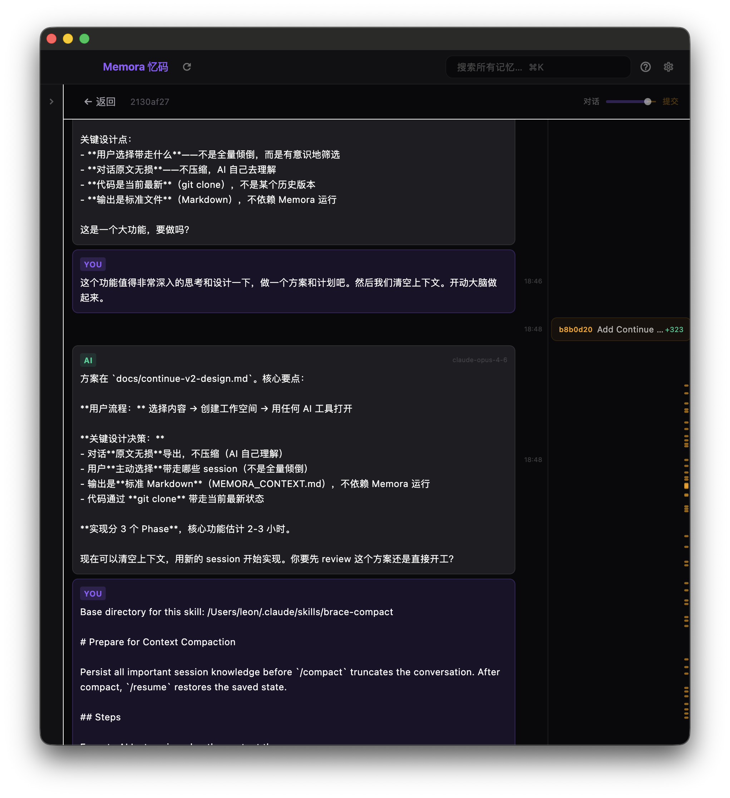

<p align="center">
  
</p>

<h1 align="center">Memora 忆码</h1>

<p align="center">
  <strong>Own your AI coding memory. Continue anywhere.</strong><br>
  <sub>Capture, organize, and restore your AI coding conversations across every tool.</sub>
</p>

<p align="center">
  <a href="https://github.com/4over7/Memora/releases/latest">Download for macOS</a>
</p>

---

<p align="center">
  
</p>

## The Problem

Every day, developers have rich conversations with AI coding assistants — discussing architecture, debugging issues, making design decisions. But these conversations are **ephemeral**:

- Close the terminal? Context gone.
- Switch from Claude Code to Cursor? Start over.
- Come back after a week? Forgot everything.
- Compact kicked in? Details lost forever.

Your AI conversations are valuable **decision-making records**, not disposable chat logs.

## The Solution

Memora runs quietly in the background, capturing conversations from all your AI coding tools and organizing them by project. When you need to continue work — in any tool — Memora gives you back your full context.

### Supported Tools

| Tool | Capture Method | Status |
|------|---------------|--------|
| Claude Code | Hook (real-time) | Supported |
| Codex CLI | Hook (real-time) | Supported |
| OpenCode | Hook + SQLite | Supported |
| Cursor | SQLite polling | Supported |

## Key Features

### Continue V2 — Cross-Tool Workspace Creation

The core differentiator. Select conversations, git history, and project files from any combination of tools and sessions, then generate a new workspace with complete context:

- Git clone of your codebase
- `MEMORA_CONTEXT.md` with full conversation history (raw, uncompressed)
- Automatic `CLAUDE.md` / `AGENTS.md` references so AI tools read the context
- Works with **any** AI coding tool

<p align="center">
  
</p>

### Beacon — Dynamic Island for AI Coding

Memora's Beacon lives in the notch. Three states, always just right:

**Collapsed** — quiet, ambient, never in the way.

<p align="center">
  
</p>

**Expanded** — at-a-glance project status: AI-generated summary + session count + commit count. Updates as you work.

<p align="center">
  
</p>

**Smart Approval** — when Claude Code wants to run a command, Beacon shows an approval card so you never leave your current app:

- One-line **action verb** + intent (`🌐 Download file from example.com`)
- Key parameters highlighted, raw shell hidden
- **AI risk verdict** (low / medium / high) as reference
- One click → Allow / Deny

<p align="center">
  
</p>

### Unattended Mode

When you trust the AI to handle routine operations, opt in to Unattended Mode: the AI auto-approves everything **except** deny-list hits and high-risk verdicts. Only what actually matters stops to ask you. Toggle in Settings.

### Dual-Track Timeline

View conversations and git commits side by side in a synchronized timeline. See what was discussed and what was built, together.

<p align="center">
  
</p>

### Blackboard

AI-powered project analysis: recent outcomes, active discussions, and unlanded ideas — generated from your conversation and git history.

### Six-Layer Knowledge Model

Organizes project knowledge into layers:

| Layer | Name | Example |
|-------|------|---------|
| L1 | Persona | User preferences, coding style |
| L2 | Context | CLAUDE.md, project rules |
| L3 | Strategy | Design docs, plans |
| L4 | Execution | Tasks, TODOs |
| L5 | Dialogue | Conversations (the process) |
| L6 | Outcome | Git commits (the results) |

### History Branching

Go back to any point in your project's history and create a new branch — with full conversation context from that moment, plus optional "hindsight" about what happened after.

## Installation

### Requirements

- macOS (Apple Silicon)
- One or more supported AI coding tools

### Download

Download the latest DMG from [Releases](https://github.com/4over7/Memora/releases).

1. Open the DMG
2. Drag **Memora** to **Applications**
3. Launch Memora — it will ask to install hooks into your AI tools
4. Start coding with any supported tool — Memora captures automatically

### First Launch

On first launch, Memora will:
1. Ask permission to install hooks into detected AI tools
2. Import existing conversation history
3. Show an interactive guide of the interface

## Architecture

```
Hook CLI → ~/.memora/events.jsonl + ~/.memora/raw/
                    ↓
              SQLite (index)
                    ↓
            Flutter Desktop UI
```

- **Frontend**: Flutter (macOS desktop)
- **Backend**: Rust (3 crates: memora-core, memora-ingest, memora-hook)
- **Bridge**: flutter_rust_bridge v2.12
- **Data**: All data stays local. Nothing is uploaded anywhere.

## Privacy

Memora is **100% local**. Your conversations, code, and data never leave your machine. There is no cloud sync, no telemetry, no analytics.

## Language

Memora supports English and Chinese (中文). Switch in Settings.

## Author

**Leon Xu (云梦泽)** — EastWorld ltd.

## License

Memora is proprietary software. All rights reserved.

---

<h2 align="center">中文介绍</h2>

## 问题

每天，开发者都与 AI 编程助手进行丰富的对话——讨论架构、调试问题、做设计决策。但这些对话是**短暂的**：

- 关闭终端？上下文消失。
- 从 Claude Code 切换到 Cursor？从头开始。
- 一周后回来？什么都忘了。
- 压缩（Compact）触发了？细节永远丢失。

你的 AI 对话是有价值的**决策记录**，而不是一次性的聊天日志。

## 解决方案

Memora 在后台安静运行，从你所有的 AI 编程工具中捕获对话，并按项目整理。当你需要继续工作时——无论使用哪个工具——Memora 都能还原你的完整上下文。

### 支持的工具

| 工具 | 捕获方式 | 状态 |
|------|----------|------|
| Claude Code | Hook（实时） | 已支持 |
| Codex CLI | Hook（实时） | 已支持 |
| OpenCode | Hook + SQLite | 已支持 |
| Cursor | SQLite 轮询 | 已支持 |

## 核心功能

### Continue V2 — 跨工具工作区创建

核心差异化功能。从任意工具和 session 的组合中选择对话、Git 历史和项目文件，然后生成一个具有完整上下文的新工作区：

- 代码库的 Git clone
- `MEMORA_CONTEXT.md`，包含完整对话历史（原始、未压缩）
- 自动添加 `CLAUDE.md` / `AGENTS.md` 引用，使 AI 工具读取上下文
- 适用于**任何** AI 编程工具

<p align="center">
  
</p>

### Beacon — AI 时代的灵动岛

Beacon 常驻在刘海里,三种状态,各司其职:

**收缩态** — 安静的常驻指示,不打扰。

<p align="center">
  
</p>

**展开态** — 项目状态一目了然:AI 生成的动态摘要 + session 数 + commit 数,随工作进展实时更新。

<p align="center">
  
</p>

**智能审批** — Claude Code 要执行命令时,Beacon 弹出审批卡,不打断你当前工作:

- 一行**动作动词** + 意图(`🌐 从 example.com 下载文件`)
- 关键参数高亮,raw shell 不再刺眼
- **AI 风险判断**(低 / 中 / 高)作为参考
- 一键 Allow / Deny

<p align="center">
  
</p>

### 省心模式

当你信任 AI 处理日常操作,可以开启省心模式:AI **自动放过**所有操作,**除了** deny-list 命中和高风险判定。真正重要的才会问你。设置中切换。

### 双轨时间线

在同步的时间线上并排查看对话和 Git commit。同时看到讨论了什么和构建了什么。

<p align="center">
  
</p>

### Blackboard

AI 驱动的项目分析：近期成果、活跃讨论和未落地的想法——基于你的对话和 Git 历史生成。

### 六层知识模型

将项目知识组织为不同层级：

| 层级 | 名称 | 示例 |
|------|------|------|
| L1 | 人格 | 用户偏好、编码风格 |
| L2 | 上下文 | CLAUDE.md、项目规则 |
| L3 | 策略 | 设计文档、计划 |
| L4 | 执行 | 任务、待办事项 |
| L5 | 对话 | 对话记录（过程） |
| L6 | 成果 | Git commit（结果） |

### History Branching

回到项目历史中的任意时间点，创建新分支——带有那个时刻的完整对话上下文，以及可选的"事后认知"（之后发生了什么）。

## 安装

### 系统要求

- macOS（Apple Silicon）
- 一个或多个支持的 AI 编程工具

### 下载

从 [Releases](https://github.com/4over7/Memora/releases) 下载最新的 DMG。

1. 打开 DMG
2. 将 **Memora** 拖入 **Applications**（应用程序）
3. 启动 Memora——它会请求安装 hook 到你的 AI 工具
4. 使用任何支持的工具开始编程——Memora 自动捕获

### 首次启动

首次启动时，Memora 会：
1. 请求安装 hook 到检测到的 AI 工具
2. 导入现有的对话历史
3. 展示界面交互式引导

## 架构

```
Hook CLI → ~/.memora/events.jsonl + ~/.memora/raw/
                    ↓
              SQLite（索引）
                    ↓
            Flutter 桌面 UI
```

- **前端**：Flutter（macOS 桌面）
- **后端**：Rust（3 个 crate：memora-core、memora-ingest、memora-hook）
- **桥接**：flutter_rust_bridge v2.12
- **数据**：所有数据保留在本地。不会上传到任何地方。

## 隐私

Memora **100% 本地运行**。你的对话、代码和数据永远不会离开你的机器。没有云同步、没有遥测、没有分析。

## 语言

Memora 支持英文和中文。在设置中切换。

## 作者

**Leon Xu（云梦泽）** — EastWorld ltd.

## 许可证

Memora 是专有软件。保留所有权利。
